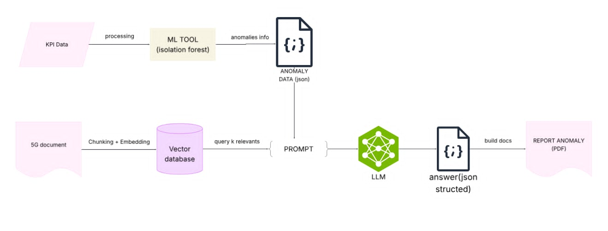

##  Luồng hoạt động

  

---

##  Các thành phần chính

###  1. `MLDetectTool.py`

Chứa các **hàm xử lý dữ liệu, phát hiện bất thường, và vẽ biểu đồ**.

| Hàm | Mô tả |
|------|-------|
| `load_data(file_path)` | Đọc file CSV KPI, chuẩn hóa cột thời gian và trả về DataFrame. |
| `detect_anomaly(df, fields, method="isolation_forest")` | Phát hiện điểm bất thường theo từng trường KPI, mặc định dùng Isolation Forest. |
| `scale_features(df, percent_cols=[], std_cols=[], robust_cols=[])` | Chuẩn hóa dữ liệu bằng MinMax, Standard hoặc RobustScaler. |
| `aggregate_by_window(df, window_len)` | Gộp dữ liệu theo cửa sổ thời gian để giảm nhiễu. |
| `plot_anomaly(df, date, node=None, field=None, save_dir="plot_pics", drawn_fields=None)` | Vẽ biểu đồ KPI theo ngày, highlight điểm hoặc vùng bất thường. |
| `create_json_output(answer_text, json_path, output_path)` | Parse phần JSON từ phản hồi của model, lưu ra `result_structured.json`. |
| `create_pdf_output(answer_text, json_input, output_pdf)` | Sinh báo cáo PDF có phần mô tả và biểu đồ minh họa. |

---
